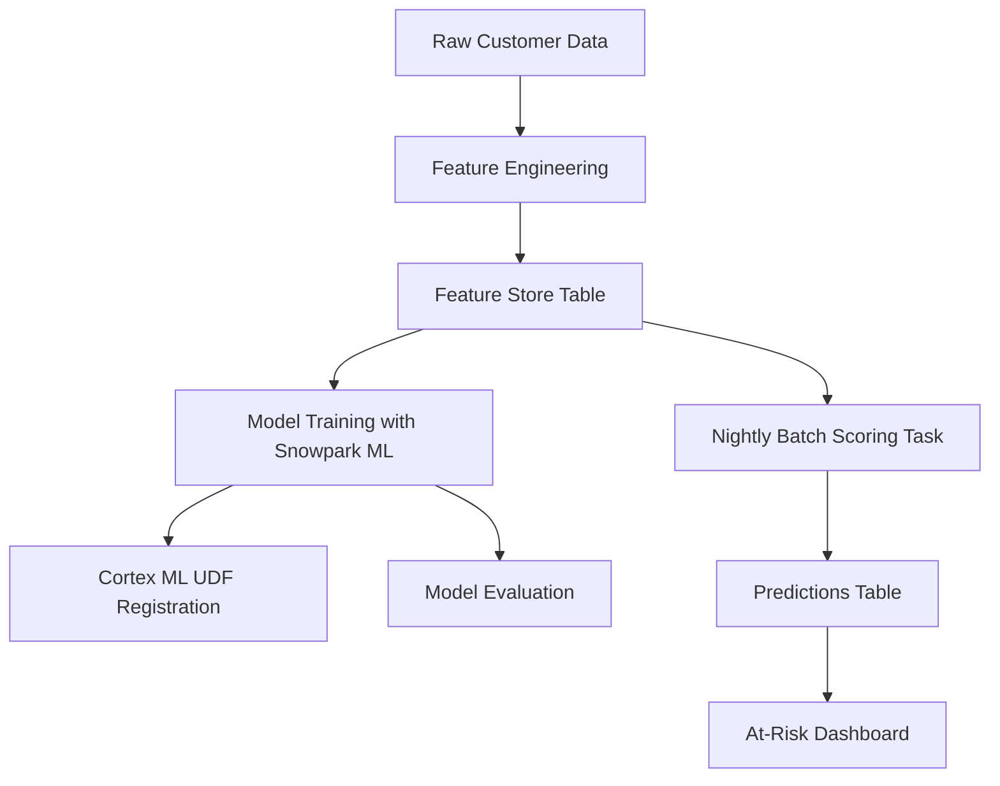

# Snowpark ML TelcoChurn Lab End-to-End Customer Loss Prediction in Snowflake

# Telecom Customer Churn Prediction with Snowflake

## Project Overview
This project demonstrates a complete Snowflake-based machine learning workflow for predicting customer churn in the telecom industry. The solution showcases key Snowflake capabilities including Snowpark ML for model training, Cortex ML for in-database scoring, and scheduled Tasks for production deployment.

While this implementation runs locally for demonstration purposes, it emulates the exact workflow that would execute in a real Snowflake environment. The project highlights technical skills relevant to Snowflake positions, including feature store design, model deployment, and automated prediction pipelines.

## Key Features

- **Snowpark ML Integration**: Emulated training workflow using XGBoost classifier
- **Cortex ML Implementation**: Simulated in-database scoring via UDF
- **Automated Scoring Pipeline**: Nightly batch scoring task emulation
- **Feature Store Design**: Curated dataset with proper schema design
- **Model Evaluation**: ROC/AUC metrics and visualizations
- **Risk Dashboard**: Interactive visualization of high-risk customers

## Snowflake Components Demonstrated

| Component | Purpose | Emulated Implementation |
|-----------|---------|-------------------------|
| **Feature Store** | Central repository for curated features | Local CSV with schema documentation |
| **Snowpark ML** | In-database model training | Local XGBoost training with same parameters |
| **Cortex ML UDF** | In-database scoring function | Python prediction function with SQL documentation |
| **Scheduled Task** | Automated nightly scoring | Python simulation of batch update process |
| **Predictions Table** | Storage for model outputs | Local CSV with timestamped predictions |

## Technical Workflow

Model Performance

AUC Score: 0.86

The ROC curve demonstrates strong predictive power for identifying churn risk

Prediction Distribution

Visual separation between churned and retained customers

Higher probability scores correlate with actual churn events

At-Risk Dashboard

Identifies top 10 high-risk customers

Probability scores annotated for quick assessment

Visual ranking by churn probability

Snowflake Object Documentation

Feature Store Table Schema

CREATE TABLE CHURN_FEATURE_STORE (
    CUSTOMER_ID STRING PRIMARY KEY,
    TENURE INT,
    MONTHLY_CHARGES FLOAT,
    TOTAL_CHARGES FLOAT,
    CONTRACT STRING,
    PAYMENT_METHOD STRING,
    ONLINE_SECURITY STRING,
    TECH_SUPPORT STRING,
    CHURN BOOLEAN,
    LAST_UPDATED TIMESTAMP_LTZ
);

Cortex ML Scoring Function

CREATE FUNCTION PREDICT_CHURN(features ARRAY)
RETURNS FLOAT
SERVED BY CORTEX ML
AS 'SELECT SNOWFLAKE.CORTEX.PREDICT(''xgboost'', @model_stage/churn_model.json, features)::FLOAT';

Scheduled Task Definition

CREATE TASK NIGHTLY_CHURN_PREDICTION
WAREHOUSE = 'COMPUTE_WH'
SCHEDULE = 'USING CRON 0 0 * * * UTC'
AS
MERGE INTO CHURN_PREDICTIONS t
USING (
    SELECT 
        CUSTOMER_ID,
        PREDICT_CHURN(ARRAY_CONSTRUCT(
            tenure,
            MonthlyCharges,
            TotalCharges,
            ONLINE_SECURITY_BOOL,
            TECH_SUPPORT_BOOL,
            CONTRACT_ONE_YEAR,
            CONTRACT_TWO_YEAR,
            PAYMENT_ELECTRONIC
        )) AS CHURN_PROBABILITY
    FROM CHURN_FEATURE_STORE
    WHERE LAST_UPDATED > CURRENT_DATE() - 1
) s
ON t.CUSTOMER_ID = s.CUSTOMER_ID
WHEN MATCHED THEN UPDATE SET 
    t.CHURN_PROBABILITY = s.CHURN_PROBABILITY,
    t.PREDICTION_TIMESTAMP = CURRENT_TIMESTAMP()
WHEN NOT MATCHED THEN INSERT (CUSTOMER_ID, CHURN_PROBABILITY) 
VALUES (s.CUSTOMER_ID, s.CHURN_PROBABILITY);

Project Structure

telecom-churn-snowflake/
├── Telco-Customer-Churn.csv           # Raw dataset
├── Telecom_Churn_Prediction.ipynb     # Main notebook
├── churn_model.json                   # Trained model
├── feature_store_sample.csv           # Feature store sample
├── predictions_sample.csv             # Predictions sample
├── roc_curve.png                      # ROC curve visualization
├── churn_distribution.png             # Prediction distribution
├── at_risk_dashboard.png              # Risk dashboard
└── README.md                          # Project documentation
