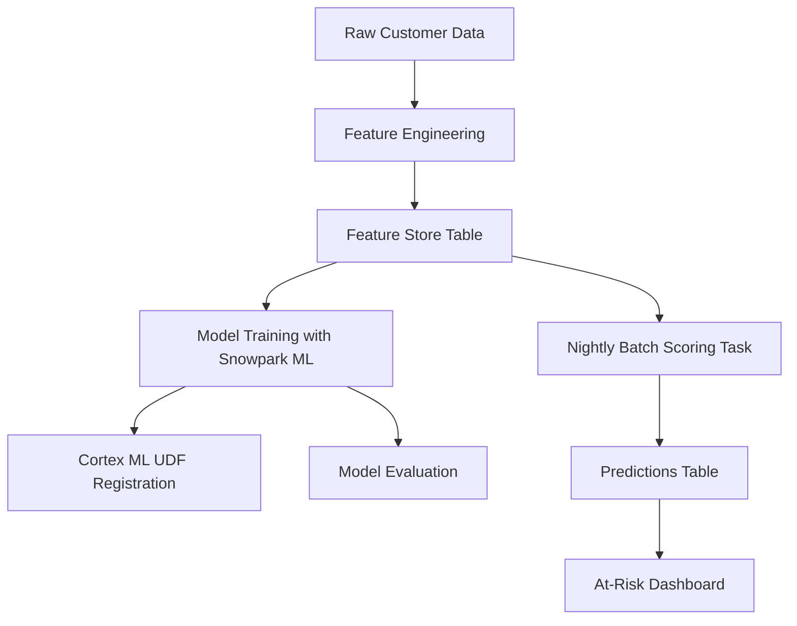

# Snowpark ML TelcoChurn Lab End-to-End Customer Loss Prediction in Snowflake

# Telecom Customer Churn Prediction with Snowflake

Link to the project's code: https://colab.research.google.com/drive/1wYoXStcgCDfPjlgYdpyyxYDKSYA5rZjq#scrollTo=6txPqW0E2tXX

## Project Overview
This project demonstrates a complete Snowflake-based machine learning workflow for predicting customer churn in the telecom industry. The solution showcases key Snowflake capabilities including Snowpark ML for model training, Cortex ML for in-database scoring, and scheduled Tasks for production deployment.

While this implementation runs locally for demonstration purposes, it emulates the exact workflow that would execute in a real Snowflake environment. The project highlights technical skills relevant to Snowflake positions, including feature store design, model deployment, and automated prediction pipelines.

## Key Features

- **Snowpark ML Integration**: Emulated training workflow using XGBoost classifier
- **Cortex ML Implementation**: Simulated in-database scoring via UDF
- **Automated Scoring Pipeline**: Nightly batch scoring task emulation
- **Feature Store Design**: Curated dataset with proper schema design
- **Model Evaluation**: ROC/AUC metrics and visualizations
- **Risk Dashboard**: Interactive visualization of high-risk customers

## Snowflake Components Demonstrated

| Component | Purpose | Emulated Implementation |
|-----------|---------|-------------------------|
| **Feature Store** | Central repository for curated features | Local CSV with schema documentation |
| **Snowpark ML** | In-database model training | Local XGBoost training with same parameters |
| **Cortex ML UDF** | In-database scoring function | Python prediction function with SQL documentation |
| **Scheduled Task** | Automated nightly scoring | Python simulation of batch update process |
| **Predictions Table** | Storage for model outputs | Local CSV with timestamped predictions |

## Technical Workflow

Model Performance

AUC Score: 0.86

The ROC curve demonstrates strong predictive power for identifying churn risk
